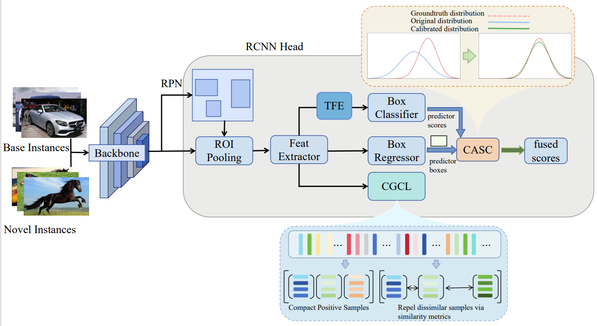
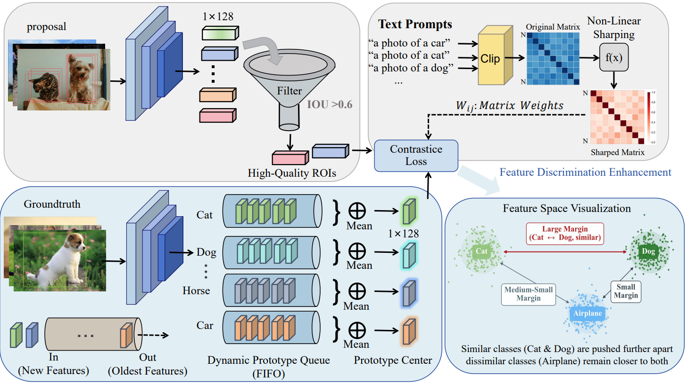
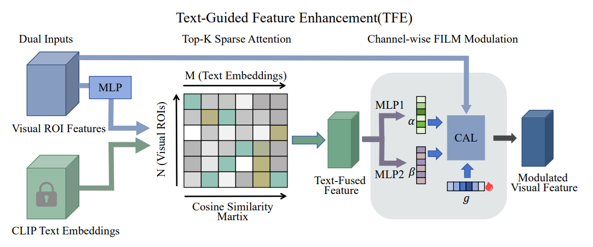
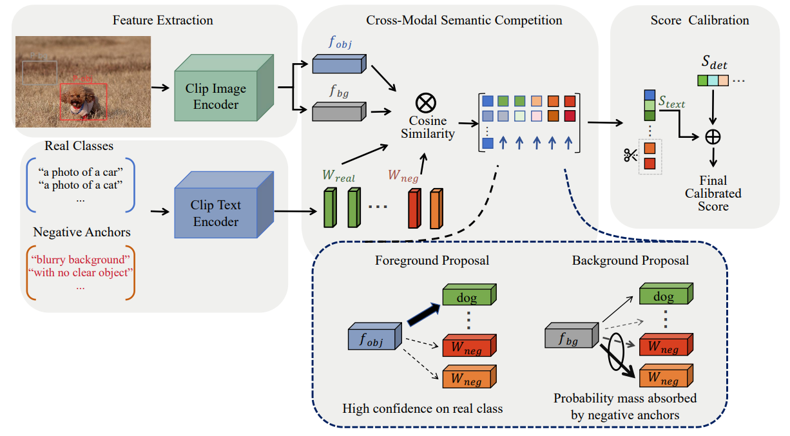
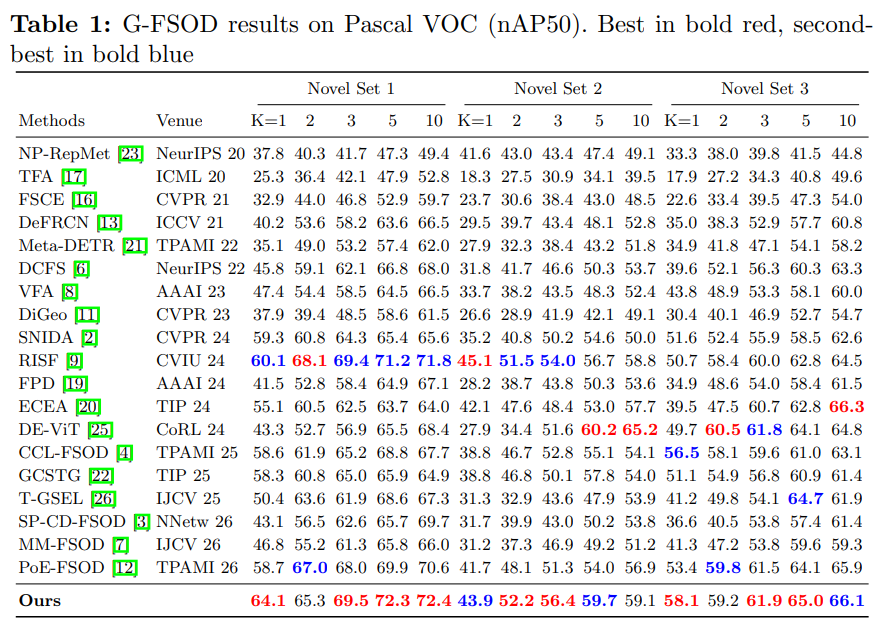
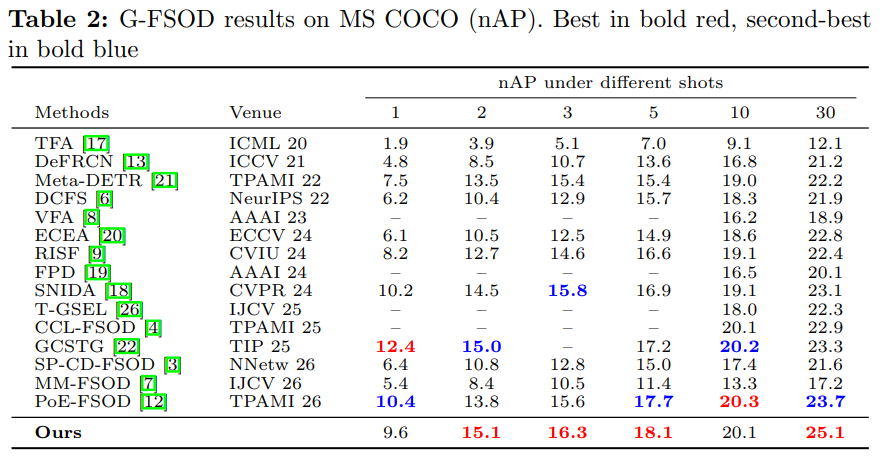

# SDCC: Semantics-Driven Contrastive Learning and Calibration for Few-Shot Object Detection

This project proposes a semantics-driven framework for Few-Shot Object Detection (FSOD). The framework contains three key modules: **CGCL** for semantics-guided prototype contrastive learning, **TFE** for text-guided feature modulation, and **CASC** for CLIP-assisted score calibration.

The main idea of SDCC is to introduce CLIP semantic priors into both training and inference. During training, semantic priors help improve feature discriminability and stabilize class prototypes. During inference, they help calibrate detection scores and reduce high-confidence false positives.

## Overall Framework



**Training stage**: GDL gradient decoupling → Res5 feature extraction → TFE text-guided modulation → classification/regression + CGCL contrastive learning

**Inference stage**: detector output → CASC with negative semantic anchors → final scores

---

## Core Modules

### 1. CGCL — Semantics-Guided Prototype Contrastive Learning



CGCL uses CLIP semantic information to guide contrastive learning. It aims to improve the separation between similar categories and make class prototypes more stable under few-shot settings.

- A pre-computed inter-class semantic similarity matrix is built from CLIP text embeddings and used to guide contrastive learning.
- Negative samples from semantically similar categories are assigned stronger repulsion, helping the model learn finer differences between easily confused classes.
- A dynamic memory prototype bank is maintained for each class to store historical features and build more stable class prototypes.
- This design helps improve feature discriminability when only a few annotated samples are available.

### 2. TFE — Text-Guided Feature Modulation



TFE introduces CLIP text semantics into the classification branch to enhance ROI features. It helps novel-class features become more discriminative under limited supervision.

- CLIP text embeddings are used as semantic cues to modulate ROI visual features.
- Top-k sparse attention selects the most relevant category texts and reduces the influence of unrelated categories.
- Gated FiLM modulation is used to perform channel-wise feature enhancement.
- The module is applied only to the classification branch, since box regression mainly relies on category-agnostic localization information.

### 3. CASC — CLIP-Assisted Score Calibration



CASC is used during inference to calibrate detection scores and suppress false positives. It introduces negative semantic anchors into the CLIP semantic space, allowing background regions and low-quality proposals to be better distinguished from true objects.

- CLIP visual features are extracted from detection boxes and compared with category text embeddings.
- Negative Semantic Anchors are introduced as text prompts describing typical false-positive patterns, such as blurry regions or random textures.
- These anchors participate in the softmax competition and provide additional semantic references for background regions and low-quality proposals.
- CASC helps reduce high-confidence false positives while preserving the original detection ability of the detector.
- Dirichlet-Softmax hybrid scoring is used to keep sharp classification ability while reducing over-confidence.

---

## Experimental Results

### Pascal VOC



### MS COCO



---

## Requirements

- Python 3.8+
- PyTorch 1.9+
- Detectron2
- CLIP (OpenAI)
- fvcore
- scikit-learn

```bash
# Install Detectron2
pip install detectron2 -f https://dl.fbaipublicfiles.com/detectron2/wheels/cu111/torch1.9/index.html

# Install other dependencies
pip install ftfy regex tqdm scikit-learn fvcore
pip install git+https://github.com/openai/CLIP.git
```

---

## Data Preparation

Please refer to [DeFRCN](https://github.com/er-muyue/DeFRCN) — Decoupled Faster R-CNN for preparing the Pascal VOC and MS COCO datasets.

The expected directory structure is as follows:

```text
datasets/
├── VOC2007/
├── VOC2012/
├── coco/
├── cocosplit/
├── vocsplit/
└── ImageNetPretrained/
    ├── MSRA/R-101.pkl
    └── torchvision/resnet101-5d3b4d8f.pth
```

---

## Usage

### 1. Base Pre-training

```bash
# VOC, using split1 as an example
python3 main.py --num-gpus 4 \
    --config-file configs/voc/defrcn_det_r101_base1.yaml \
    --opts MODEL.WEIGHTS datasets/ImageNetPretrained/MSRA/R-101.pkl \
           OUTPUT_DIR checkpoints/defrcn_det_r101_base1
```

### 2. Few-Shot Fine-tuning on VOC GFSOD

```bash
bash run_voc_gfsod_finetuning.sh r101 1 sdcc 1
```

Arguments:

```text
r101   - backbone network, ResNet-101
1      - number of GPUs
sdcc   - experiment name, which determines the checkpoint save path
1      - VOC split ID, 1/2/3
```

### 3. Few-Shot Fine-tuning on COCO GFSOD

```bash
bash run_coco_gfsod_finetuning.sh r101 4 sdcc
```

Arguments:

```text
r101   - backbone network, ResNet-101
4      - number of GPUs
sdcc   - experiment name
```

### 4. Evaluation with CASC Calibration

```bash
bash run_cmclip_eval.sh r101 1 sdcc 1
```

---

## Acknowledgements

This project is based on the following works:

- [DeFRCN](https://github.com/er-muyue/DeFRCN) — Decoupled Faster R-CNN
- [DCFS](https://github.com/gaobb/DCFS) — Dual-path CLIP Few-Shot
- [Detectron2](https://github.com/facebookresearch/detectron2) — Facebook AI Research
- [CLIP](https://github.com/openai/CLIP) — OpenAI